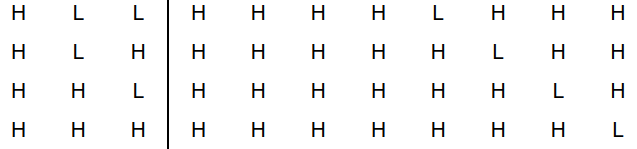
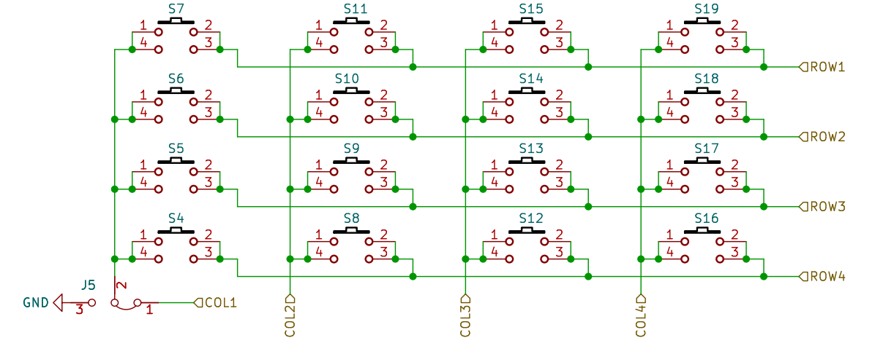

# 蓝桥杯大模板
## [锁存器](#1)
## [定时器相关](#2)
## [pca捕获计数器](#3)
## [按键](#4)
## [十六进制数转换十进制数](#5)
## [通讯协议](#6)
## [超声波测距](#7)
## [频率测量](#8)
### <div id = '1'>锁存器 </div>

74HC138控制选择写入哪个寄存器(Y4,Y5,Y6,Y7)
真值表：
P25 P26 P27 


<mark>先把P2高三位清空</mark>,再或上对应的真值
LED选择
```c
P2 = (P2 & 0x1f) | 0x80;
P2 &= 0x1f;
```
数码管 位选
```c
P2 = (P2 & 0x1f) | 0xC0;
P2 &= 0x1f;
```
数码管 段选
```c
P2 = (P2 & 0x1f) | 0xE0;
P2 &= 0x1f;
```
蜂鸣器
```c
P2 = (P2 & 0x1f) | 0xA0;
P2 &= 0x1f;
```

### <div id = 2>定时器相关</div>
初始化代码用isp软件生成
定时器分配：定时器1用于轮询处理，定时器2用于串口通讯.
定时器1 选择1ms中断，16位自动重载，12T模式
定时器2 用于串口
#### 定时器以及中断相关寄存器
##### <mark>EA中断使能寄存器</mark>初始化时候EA = 1；
##### <mark>ET1 定时器1中断使能</mark>

### <div id = 3>ulSound-pca捕获相关</div>
#### 步骤:
1.发送8个方波40MHz方波(发送前关闭总中断,发送后开启) 
2.配置pca
3.等到收到方波(收到后Rx为0)`while((Rx == 1) && (CF == 0));`
4. 收到后`time * 0.017(340 * time / 2 / 1000)`
#### 重要定时器
##### CMOD:配置成0x00;
##### CF:溢出寄存器，溢出写完会变1，记得软件清零
##### CR：计数允许寄存器，写1才可以计数，用完记得写0
##### <mark>CH,CL</mark>:计数器高八位和低八位，用前记得清零
```c
time = (CH << 8) | CL;
```
得到计数器的值

### <div id = 4>按键</div>
#### 按键三行消除抖动
```c
static unsigned char KeyVal,KeyOld,KeyDown,KeyUp;
KeyVal = KeyRead();
KeyDown = KeyVal & (KeyVal ^ KeyOld);
KeyUp = ~KeyVal & (KeyVal ^ KeyOld);
KeyOld = KeyVal;
```
#### 获取16个按键的状态


由图可见col1与row4对应的最小的键号
同时P30对应row1。所以col正常选择后用
`(P3 & (0x08 >> row)) == 0`来反向选择row
`P3 == 0`表明此时(3-row)和col对应的按键被按下
`KeyNum`的对应表示16个按键的状态所以要用<mark>|=</mark>
`KeyNum |=(1 << (col * 4 + row))` 
```c
unsigned int KeyRead(void)
{
    int col ,row;
    unsigned int KeyNum = 0;
    for(col = 0;col < 4;col++)
    {
        P44 = (col != 0);
        P42 = (col != 1);
        P35 = (col != 2);
        //P34 = (col != 3);
        for(row = 0;row<4;row++)
        {
            if( (P3 & (0x08 >> row)) == 0  )
            {
                KeyNum |=(1 << (col * 4 + row));
            }
        }
    }
    P3 = 0xff;
    return KeyNum;
}
```
调用方法：
`0x0001 << (i - 4)`对应的按钮号和实际序号差4
`KeyDown & KeyNum(i)`清空其他位置，只看某一位
Key.h里
```c
#define KeyNum(i) 0x0001 << (i - 4)
#define KeyDownNum(i) ((KeyDown & KeyNum(i)) != 0)
#define KeyUpNum(i) ((KeyUp & KeyNum(i)) != 0)
```
消抖获得`KeyDown`后
下程序实现按下4，按下5，同时按下45 分别处理不同的事件
```
    if(KeyDownNum(4) && !(KeyDownNum(5)))
    {
        SegBuf[0]++;
    }
    if(!(KeyDownNum(4)) && (KeyDownNum(5)))
    {
        SegBuf[1]++;
    }   
    if((KeyDownNum(4)) && (KeyDownNum(5)))
    {
        SegBuf[2]++;
    }      
```

### <div id = 5>进制相关</div>
#### 10转换16进制
```c
ans = num / 10 << 4 |  num % 10;
```
#### 16转换10进制<mark>务必加括号</mark>
```c
ans = (tmp >>4 ) *10 + (tmp & 0x0F);
```
### <div id =6>通讯</div>
#### iic通讯 读模式
1.读数据前必须先在指定位置写一个空字符<mark>写模式后不需要stop</mark>
2.ack<mark>写1不继续读</mark>，写0继续读取
```c
    I2CStart();
    I2CSendByte(0x90);
    I2CWaitAck();
    I2CSendByte(addr);
    I2CWaitAck();

    I2CStart();
    I2CSendByte(0x91);
    I2CWaitAck();
    val=I2CReceiveByte();
    I2CSendAck(1);
    I2CStop();
```
#### 串口
##### 初始化
isp 生成串口1用定时器2作为波特率发生器，1T模式
ES = 1打开串口中断
```c
void Uart1_Init(void)	//9600bps@12.000MHz
{
	SCON = 0x50;		//8位数据,可变波特率
	AUXR |= 0x01;		//串口1选择定时器2为波特率发生器
	AUXR |= 0x04;		//定时器时钟1T模式
	T2L = 0xC7;			//设置定时初始值
	T2H = 0xFE;			//设置定时初始值
	AUXR |= 0x10;		//定时器2开始计时
    ES = 1;
    EA = 1;
}
```
##### 发送接收相关寄存器
RI:接收中断标志位，必须软件清零
TI:发送中断标志位,发送成功后硬件把TI写1,必须软件等待到TI写1后清零后发送下一字节

发送过程：
重写printf的底层putchar(stdio.h中)
```c
extern char putchar(char ch)
{
    SBUF = ch;
    while(TI == 0);
    TI = 0;
    return ch;
}
```
<mark>发送时如果要发送数字需要强转为unsigned int或int等，不能直接发送char作为数字,如</mark>
```c
unsigned char chh = 123;
printf("%d",(int)chh);
printf("%u",(unsigned int)chh);
```
接受过程
接收中断:
中断号为4，<mark>注意手动清除RI</mark>
```c
void UartRoutine(void) interrupt 4
{
    if(RI)
    {
        SysTick = 0;
        UartBuf[UartBufIndex++] = SBUF;
        RI = 0;
        if(UartBufIndex > 10)
            UartBufIndex = 0;
    }
}
```
处理过程：
如果超时就清空接受数组
```c
void UartProc(void)
{    
    if(UartBufIndex == 0)
        return;
    if(SysTick >= 10)
    {
        SysTick = 0;
        memset(UartBuf,0,UartBufIndex);
        UartBufIndex = 0;
    }
}
```
### <div id = 7>超声波测距</div>
#### 发送方波
<mark> 发送前后需要关闭/打开中断</mark>
```c
void SendUlSound(void)
{
    unsigned char i;
    EA = 0;
    for(i = 0;i<8;i++)
    {
        Tx = 1;
        Delay12us();
        Tx = 0;
        Delay12us();
    }
    EA = 1;
}
```
<mark> CR为计数开始寄存器</mark>
<mark>收到数据时Rx = 0,等待过程`while((Rx == 1) && (CF == 0));`</mark>
```c
unsigned char GetUlSound(void)
{
    CMOD = 0x00;
    CH = CL = 0;
    CR = 1;
    SendUlSound();
    while((Rx == 1) && (CF == 0));
    CR = 0;
    if(CF == 0)
    {
        return 0.017 * ( CH<<8 | CL);
    }
    else
    {
        CF = 0;
        return 0;
    }
}
```
### <div id = 8>频率测量</div>
定时器0配置为计数器，不自动重载，手动把TH0,TL0置0
